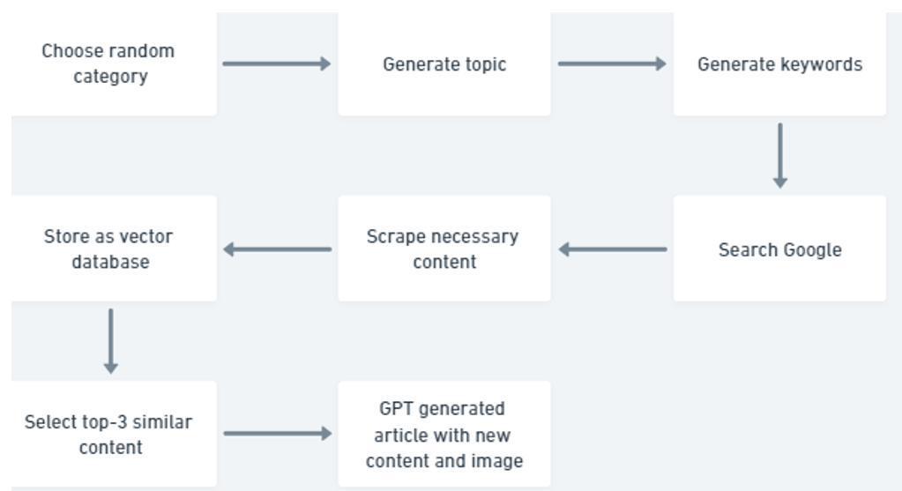

# Blog Website Project using Flask, React, Langchain, and GPT
## Introduction
Welcome to the Blog Website Project, a platform that combines the power of Flask for the backend, React for the frontend, and AI technologies such as Langchain and GPT. The website is hosted at [goldexcg.com](https://goldexcg.com/).
## Prerequisites
Before using this project, ensure that you have the following installed on your computer:
- Python 3.6 or higher
- Node.js
- Flask
- React
- Langchain
- GPT
## How it works
The Blog Website Project leverages Flask for the backend and React for the frontend. It integrates Langchain and OpenAI GPT for AI-powered content generation. The website offers a user-friendly interface, allowing users to create accounts, write blog posts, and engage with other users' content through comments, likes, and shares.

## Features
The project includes the following key features:
- User authentication and authorization
- Blog post creation and editing
- Commenting, liking, and sharing blog posts
- Language translation using Langchain
- AI-powered content generation using GPT
## Installation
To install the Blog Website Project, follow these steps:
1. Clone the repository from GitHub.
2. Install the required Python libraries using pip.
3. Install the required Node.js libraries using npm.
4. Start the Flask server using the command `flask run`.
5. Start the React server using the command `npm start`.
## Usage
To use the Blog Website Project, follow these steps:
1. Navigate to the website at [goldexcg.com](https://goldexcg.com/).
2. Create an account or log in.
3. Start writing blog posts.
4. Engage with other users' content through comments, likes, and shares.
## Testing
To test the Blog Website Project, follow these steps:
1. Install the required testing libraries using pip.
2. Run the tests using the command `pytest`.
## Status and Roadmap
The Blog Website Project is currently in active development, with ongoing work to add new features and enhance the user experience.
## Conclusion
The Blog Website Project is a cutting-edge platform that empowers users to share their ideas and engage with AI-powered content generation. By combining Flask, React, Langchain, and GPT, the project offers a unique and innovative approach to blogging. For any inquiries, please leave issues.